## 1.HTTP协议简介

超文本传输协议（英文：HyperText Transfer Protocol，缩写：HTTP）是一种用于分布式、协作式和超媒体信息 系统的应用层协议。HTTP是万维网的数据通信的基础。 HTTP的发展是由蒂姆·伯纳斯-李于1989年在欧洲核子研究组织（CERN）所发起。HTTP的标准制定由万维网协会 （World Wide Web Consortium，W3C）和互联网工程任务组（Internet Engineering Task Force，IETF）进行协 调，最终发布了一系列的RFC，其中最著名的是1999年6月公布的 RFC 2616，定义了HTTP协议中现今广泛使用的 一个版本——HTTP 1.1。

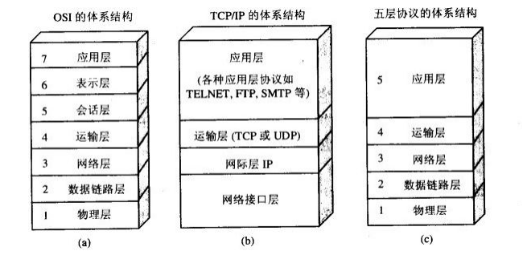


## 2.HTTP 请求/响应的步骤

2.1 客户端连接到Web服务器 一个HTTP客户端，通常是浏览器，与Web服务器的HTTP端口（默认为80）建立一个TCP套接字连接。 例如:http://www.baidu.com。 

2.2 发送HTTP请求 通过TCP套接字，客户端向Web服务器发送一个文本的请求报文，一个请求报文由请求行、请求头部、空行和请求 数据4部分组成。 

2.3 服务器接受请求并返回HTTP响应 Web服务器解析请求，定位请求资源。服务器将资源复本写到TCP套接字，由客户端读取。一个响应由状态行、响 应头部、空行和响应数据4部分组成。 

2.4 释放TCP连接 在HTTP/1.0中默认使用短连接。也就是说，客户端和服务器每进行一次HTTP操作，就建立一次连接，任务结束就 中断连接。当客户端浏览器访问的某个HTML或其他类型的Web页中包含有其他的Web资源（如JavaScript文件、 图像文件、CSS文件等），每遇到这样一个Web资源，浏览器就会重新建立一个HTTP会话。

而从HTTP/1.1起，默认使用长连接，用以保持连接特性。使用长连接的HTTP协议，会在响应头加入这行代码：

```
Connection:keep-alive
```

在使用长连接的情况下，当一个网页打开完成后，客户端和服务器之间用于传输HTTP数据的TCP连接不会关闭，客 户端再次访问这个服务器时，会继续使用这一条已经建立的连接。Keep-Alive不会永久保持连接，它有一个保持时 间，可以在不同的服务器软件（如Apache）中设定这个时间。实现长连接需要客户端和服务端都支持长连接。 HTTP协议的长连接和短连接，实质上是TCP协议的长连接和短连接。 

2.5 客户端浏览器解析HTML内容 客户端浏览器首先解析状态行，查看表明请求是否成功的状态代码。然后解析每一个响应头，响应头告知以下为若 干字节的HTML文档和文档的字符集。客户端浏览器读取响应数据HTML，根据HTML的语法对其进行格式化，并在 浏览器窗口中显示。 例如：在浏览器地址栏键入URL，按下回车之后会经历以下流程： 

​	 1.浏览器向 DNS 服务器请求解析该 URL 中的域名所对应的 IP 地址; 

2. 解析出 IP 地址后，根据该 IP 地址和默认端口 80，和服务器建立TCP连接; 
2. 浏览器发出读取文件(URL 中域名后面部分对应的文件)的HTTP 请求，该请求报文作为 TCP 三次握手的第三个 报文的数据发送给服务器; 
2. 服务器对浏览器请求作出响应，并把对应的 html 文本发送给浏览器; 
2. 浏览器将该 html 文本并显示内容;

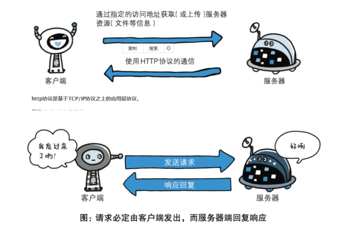

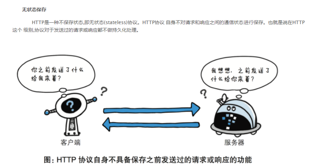


## 3.HTTP请求方法

HTTP/1.1协议中共定义了八种方法（也叫“动作”）来以不同方式操作指定的资源： 

GET 

向指定的资源发出“显示”请求。使用GET方法应该只用在读取数据，而不应当被用于产生“副作用”的操作中，例如在 Web Application中。其中一个原因是GET可能会被网络蜘蛛等随意访问。 

HEAD 

与GET方法一样，都是向服务器发出指定资源的请求。只不过服务器将不传回资源的本文部分。它的好处在于，使 用这个方法可以在不必传输全部内容的情况下，就可以获取其中“关于该资源的信息”（元信息或称元数据）。 

POST 向指定资源提交数据，请求服务器进行处理（例如提交表单或者上传文件）。数据被包含在请求本文中。这个请求 可能会创建新的资源或修改现有资源，或二者皆有。 PUT 向指定资源位置上传其最新内容。

DELETE 

请求服务器删除Request-URI所标识的资源。 

TRACE 

回显服务器收到的请求，主要用于测试或诊断。 

OPTIONS 

这个方法可使服务器传回该资源所支持的所有HTTP请求方法。用'*'来代替资源名称，向Web服务器发送OPTIONS 请求，可以测试服务器功能是否正常运作。

CONNECT

## 4. 两种开发模型 

⑴C/S又称Client/Server或客户/服务器模式。服务器通常采用高性能的PC、工作站或小型机，客户端需要安装专 用的客户端软件。如QQ,微信等软件

B/S是Brower/Server的缩写，客户机上只要安装一个浏览器（Browser）。Browser/Server是建立在广域网的基 础上的. 

⑵CS和BS结构各自的优、缺点 

 (1) C/S的优点是能充分发挥客户端PC的处理能力，很多工作可以在客户端处理后再提交给服务器。对应的优点就是 客户端响应速度快。 

缺点主要有以下几个 

1) 客户端需要安装专用的客户端软件。首先涉及到安装的工作量，其次任何一台电脑出问题，如病毒、硬件损坏， 都需要进行安装或维护。特别是有很多分部或专卖店的情况，不是工作量的问题，而是路程的问题。还有，系统软 件升级时，每一台客户机需要重新安装，其维护和升级成本非常高。 
2)  B/S最大的优点就是可以在任何地方进行操作而不用安装任何专门的软件。只要有一台能上网的电脑就能使用， 客户端零维护。系统的扩展非常容易，只要能上网，就可以使用了。甚至可以在线申请，通过公司内部的安全认证 （如CA证书）后，不需要人的参与，系统可以自动分配给用户一个账号进入系统。

## 5. Web服务器的分类

Web服务器是运行及发布Web应用的容器，只有将开发的Web项目放置到该容器中，才能使网络中的所有用户通过 浏览器进行访问。开发Java Web应用所采用的服务器主要是与JSP/Servlet兼容的Web服务器，比较常用的有 Tomcat、Resin、JBoss、WebSphere 和 WebLogic 等 

Tomcat 服务器

​		目前最为流行的Tomcat服务器是Apache-Jarkarta开源项目中的一个子项目，是一个小型、轻量级的支持JSP和 Servlet 技术的Web服务器，也是初学者学习开发JSP应用的首选 

Resin 服务器

​		Resin是Caucho公司的产品，是一个非常流行的支持Servlet和JSP的服务器，速度非常快。Resin本身包含了一 个支持HTML的Web服务器，这使它不仅可以显示动态内容，而且显示静态内容的能力也毫不逊色，因此许多网站 都是使用Resin服务器构建 JBoss服务器 JBoss是一个种遵从JavaEE规范的、开放源代码的、纯Java的EJB服务器，对于J2EE有很好的支持。JBoss采用 JML API实现软件模块的集成与管理，其核心服务又是提供EJB服务器，不包含Servlet和JSP的Web容器，不过它可 以和Tomcat完美结合 

WebSphere 服务器 

​		WebSphere是IBM公司的产品，可进一步细分为 WebSphere Performance Pack、Cache Manager 和 WebSphere Application Server等系列，其中WebSphere Application Server 是基于Java 的应用环境，可以运行 于 Sun Solaris、Windows NT 等多种操作系统平台，用于建立、部署和管理Internet和Intranet Web应用程序。 

WebLogic 服务器 

​		WebLogic 是BEA公司的产品（现在已经被Oracle收购），可进一步细分为 WebLogic Server、WebLogic Enterprise 和 WebLogic Portal 等系列，其中 WebLogic Server 的功能特别强大。WebLogic 支持企业级的、多层 次的和完全分布式的Web应用，并且服务器的配置简单、界面友好。对于那些正在寻求能够提供Java平台所拥有的 一切应用服务器的用户来说，WebLogic是一个十分理想的选择

## 6. Tomcat

(1) Tomcat下载与安装 

开源小型web服务器 ，完全免费，主要用于中小型web项目，只支持Servlet和JSP 等少量javaee规范（就是 JavaWeb编程接口） 

https://tomcat.apache.org

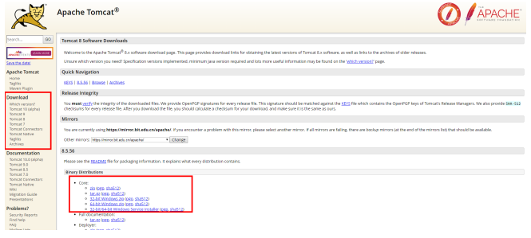

下载好之后，安装到任意目录 

安装步骤: 

1. 下载Tomcat 

2.  解压到一个没有特殊符号的目录中（一般纯英文即可） 

3.  进入到解压的目录下找到bin\startup.bat双击启动即

   注意:不建议将服务器软件放在磁盘层次很多的文件夹中!

   不建议放在中文路径下! 

   tomcat安装需要配置JAVA_HOME环境变量

(2)tomcat的目录

1、bin：该目录下存放的是二进制可执行文件，如果是安装版，那么这个目录下会有两个exe文件： tomcat9.exe、tomcat9w.exe，前者是在控制台下启动Tomcat，后者是弹出UGI窗口启动Tomcat；如果是解压 版，那么会有startup.bat和shutdown.bat文件，startup.bat用来启动Tomcat，但需要JDK的配置，shutdown.bat 用来停止Tomcat；

2、conf：这是一个非常非常重要的目录，这个目录下有四个最为重要的文件： server.xml：配置整个服务器信息。例如修改端口号，添加虚拟主机等； tomcat-users.xml：存储tomcat用户的文件，这里保存的是tomcat的用户名及密码，以及用户的角色信息。可以 按着该文件中的注释信息添加tomcat用户，然后就可以在Tomcat主页中进入Tomcat Manager页面了； 

web.xml：部署描述符文件，这个文件中注册了很多MIME类型，即文档类型。这些MIME类型是客户端与服务器之 间说明文档类型的，如用户请求一个html网页，那么服务器还会告诉客户端浏览器响应的文档是text/html类型 的，这就是一个MIME类型。客户端浏览器通过这个MIME类型就知道如何处理它了。当然是在浏览器中显示这个 html文件了。但如果服务器响应的是一个exe文件，那么浏览器就不可能显示它，而是应该弹出下载窗口才对。 MIME就是用来说明文档的内容是什么类型的！

context.xml：对所有应用的统一配置，通常我们不会去配置它。

3、lib：Tomcat的类库，里面是一大堆jar文件。如果需要添加Tomcat依赖的jar文件，可以把它放到这个目录中， 当然也可以把应用依赖的jar文件放到这个目录中，这个目录中的jar所有项目都可以共享之，但这样你的应用放到 其他Tomcat下时就不能再共享这个目录下的Jar包了，所以建议只把Tomcat需要的Jar包放到这个目录下；

4、logs：这个目录中都是日志文件，记录了Tomcat启动和关闭的信息，如果启动Tomcat时有错误，那么异常也会 记录在日志文件中。

5、temp：存放Tomcat的临时文件，这个目录下的东西可以在停止Tomcat后删除！

6、webapps：存放web项目的目录，其中每个文件夹都是一个项目；如果这个目录下已经存在了目录，那么都是 tomcat自带的项目。其中ROOT是一个特殊的项目，在地址栏中没有给出项目目录时，对应的就是ROOT项目。

 http://localhost:8080/examples，进入示例项目。其中examples就是项目名，即文件夹的名字。

7、work：运行时生成的文件，最终运行的文件都在这里。通过webapps中的项目生成的！可以把这个目录下的内 容删除，再次运行时会生再次生成work目录。当客户端用户访问一个JSP文件时，Tomcat会通过JSP生成Java文 件，然后再编译Java文件生成class文件，生成的java和class文件都会存放到这个目录下。

8、LICENSE：许可证。

9、NOTICE：说明文件。

通过url访问服务器: 

url:http://服务器的ip地址:端口号/项目名/被访问的页面 

示例:http://localhost:8080/test0918 

注: (1)启动tomcat后,tomcat会加载部署在服务器端的所有项目 (2) 浏览器访问的页面是服务器端的页面,基本上服务器的项目和工作空间的项目要保持一致

(3)IntelliJ IDEA配置Tomcat

1，点击Run---EDit Configurations...

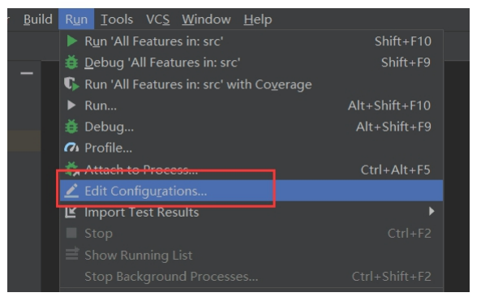

2.点击左侧“+”号，找到Tomcat Server---Local（若是没有找到Tomcat Server 可以点击最后一行 34 items more）

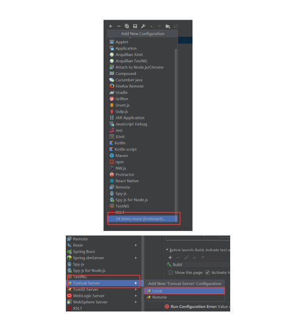

 3.在 To m c a t S e r v e r - > lo c al- > S e r v e r - > A p plic a tio n s e r v e r 项 目 下 ，

点 击 C o n fi g u r a tio n ， 找 到 本 地 To m c a t 服 务器 ， 再 点 击 O K 按 钮。

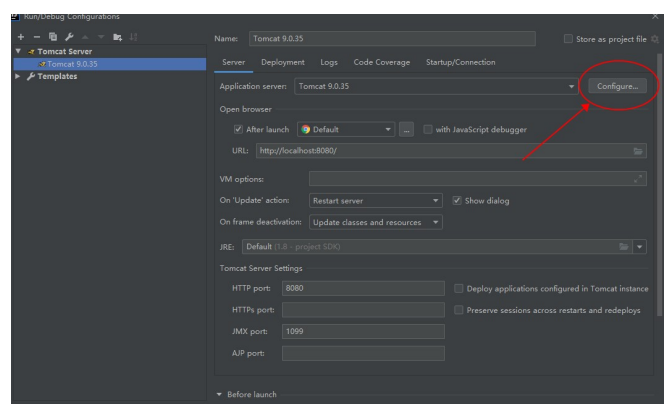

至此，IntelliJ IDEA配置Tomcat完成。

## 7.创建JavaWeb项目

1.点击左上角的File-->New-->Project

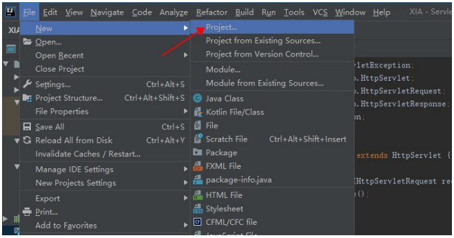

2.找到Java Enterprise之后，在Application Sever中找到自己的Tomcat，同时勾选中Web Application

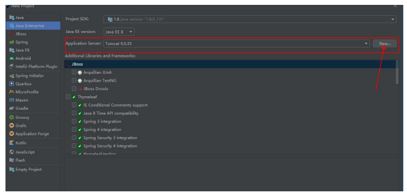

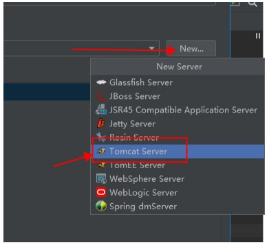

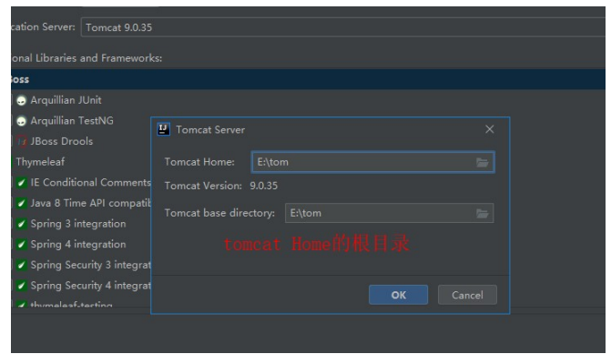

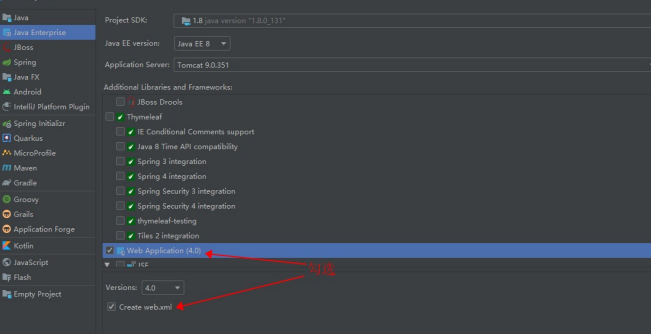

3.第一项是你的工程名字，第二个是你的工程路径，选择好之后点击finish

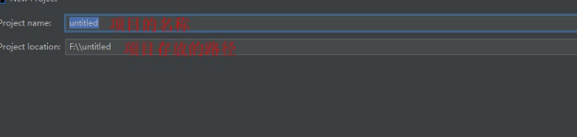

4.创建classes和lib文件夹，名字不可改

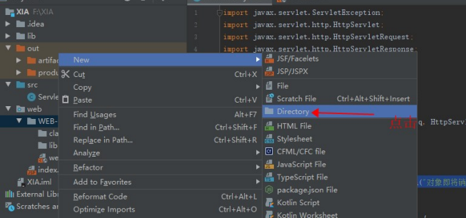

像这样

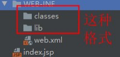

5.配置jar包和classes包：

5.1 在File中找到Project Structure

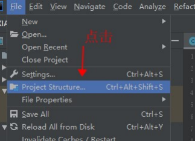

5.2 点击Modules ,选择Paths,选中Use module compile output path ,把路径改成刚刚创建的classes文件夹

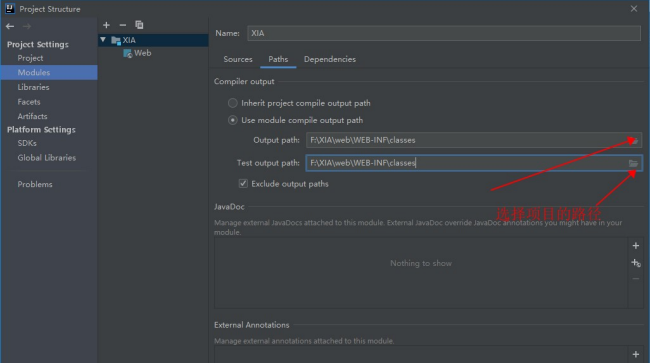

5.3 ok后再点旁边的Dependencies,点击"+"号，选择1 JARs or directories ，

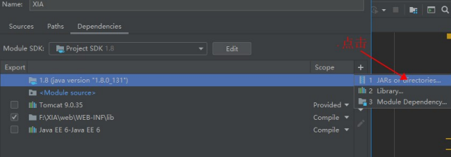

5.4，选择你刚刚创建的lib文件夹，OK

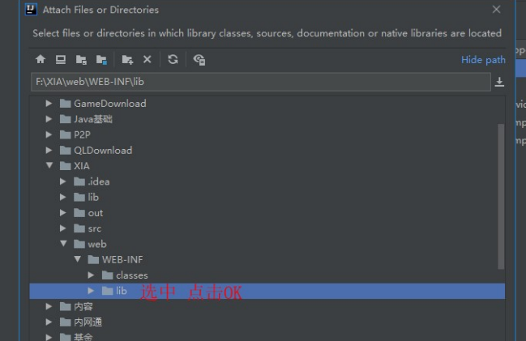

5.5 选中jar Directory。

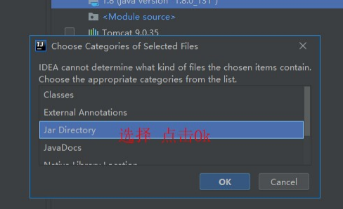

6.部署项目:将本地项目安装到服务器中

6.1回到主界面后，点击Run ，选择Edit Configurations

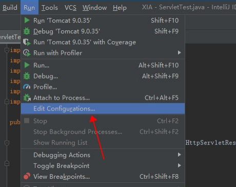

6.2 看tomcat已经有啦，这是java Enterprise的好处啦，点击Deployment ,

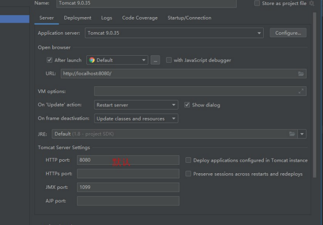

6.3点击右上角的三角形

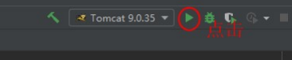

6.4 运行成功。 

至此，intellij idea创建并设置javaweb工程全部完成

## 8.修改端口号

修改配置文件:/conf/server.xml

```
<Connector port="8888" protocol="HTTP/1.1" connectionTimeout="20000"
redirectPort="8443" />
```

如果将端口号改成80,则访问项目时的请求路径就可以省略端口号。

## 9.tomcat如何管理项目

给tomcat增加管理员信息: 

配置conf/tomcat-users.xml

```
<tomcat-users>
<role rolename="manager-gui"/>
<user username="tomcat" password="tomcat" roles="manager-gui"/>
</tomcat-users>
```

注意:tomcat启动的时候会加载webapps下的所有项目

