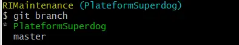
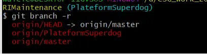
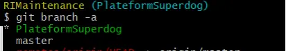

# 查看分支
A: 查看本地分支
使用 git branch命令，如下：git branch
*标识的是你当前所在的分支



B: 查看远程分支

命令如下：git branch -r



C: 查看所有分支

命令如下：git branch -a



二、本地创建新分支

命令如下：git branch [分支名称]

例如：git branch plateformSuperdog

 

三、切换到新分支

命令如下：git checkout [分支名称]

例如：git checkout plateformSuperdog

 

四、创建+切换分支

命令如下：git checkout -b [分支名称]

例如：git checkout -b plateform2

 

其中：git checkout -b [分支名称]相当于两步

git branch [分支名称]

git checkout [分支名称]

 

五、将新分支推送到github

命令如下：git push origin [分支名称]

 

六：删除本地分支

命令如下：git branch -d [分支名称]

 

七、删除github 远方分支

命令如下：git push origin :[branch name]

其中：分支前面：代表删除

例如：git push origin : plateform2

 

八：git 提交本地代码至新分支

1.切换到新分支

命令如下：git checkout [分支名称]

例如：git checkout plateform2

2.添加本地需要提交的代码

命令如下：git add .

3.提交本地代码

命令如下：git commit -m "修改说明"

4.push到git仓库

命令如下：git push origin [分支名称]

例如：git push origin plateform2 

------

# 简单总结一下：

1. 拉取仓库（克隆）：

```
git clone [ssh仓库地址]
//cd 进入仓库
cd 文件夹名（克隆的文件夹）
```

1. 将要提交的代码复制到该仓库中（克隆的文件夹中）

```
//创建分支
git branch 分支名称

//提交分支到远程仓库
git push origin 分支名

//切换想要切换的分支，
git checkout 分支名

//提交代码到想要提交的分支上
git add ./
git commit -m "提交了代码"
git push

//或者
git push origin 分支名
```

注意：这也是需要绑定github账号

# 合并分支

https://blog.csdn.net/chenyao1994/article/details/114686758

git合并分支（一看就懂）

假如我们现在在dev分支上，刚开发完项目，执行了下列命令：

```
git  add .
git  commit -m '提交的备注信息'
git  push -u origin dev
```

想将dev分支合并到master分支，操作如下：

1、首先切换到master分支上

```
git  checkout master
```

2、如果是多人开发的话 需要把远程master上的代码pull下来

```
git pull origin master
//如果是自己一个开发就没有必要了，为了保险期间还是pull
```

3、然后我们把dev分支的代码合并到master上

```
git  merge dev
```

4、然后查看状态及执行提交命令

```
git status

On branch master
Your branch is ahead of 'origin/master' by 12 commits.
  (use "git push" to publish your local commits)
nothing to commit, working tree clean

//上面的意思就是你有12个commit，需要push到远程master上 
> 最后执行下面提交命令
git push origin master
```

5、其他命令

```
更新远程分支列表
git remote update origin --prune

查看所有分支
git branch -a

删除远程分支Chapater6
git push origin --delete Chapater6

删除本地分支 Chapater6
git branch -d  Chapater6
```


# 附件

## ***\*GIT开发学习——合并分支的几种方法\****

https://blog.csdn.net/fenglolo/article/details/125223433


