## 一、背景

​		在同一台电脑上有时候需要使用多个GitHub、gitee、gitlab账号，或者说你有多个账号，不想来回生成公钥，那么这就需要使用到git配置多账户了。

## 二、准备

环境：window 10、git		

在使用之前你需要安装git，对于git安装也是点击下一步下一步就可以安装完成，在此也需要对git命令有一定的了解。


前提条件：需要C:\Users\nxg\.ssh目录（文件夹）下，打开git bash

如下图所示：

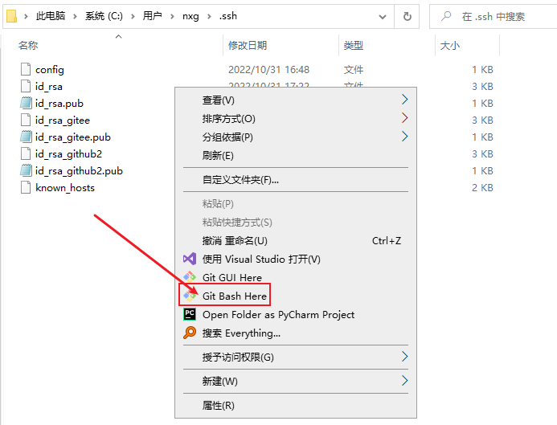

打开之后使用这个界面：

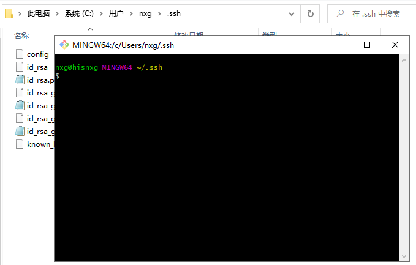

**注意：**这路径C:\Users\nxg\.ssh对于有一定基础的根据上图是能看明白，就不再赘述了。

​		为什么先执行这一步呢？原因是这样的在你创建config文件，生成密钥时都需要创建在这个**.ssh**目录（文件夹）下。如果你在其他目录下打开，那你就需要考虑创建文件时的路径问题了。为了方便明了，就使用上述方法操作，省时省力。

## 三、配置

### 3.1 创建config文件

在C:\Users\nxg\.ssh目录（文件夹）下创建config文件，并且配置ssh key的路由策略。

创建config文件：

```
touch config
```

在config文件中配置

```
# GitHub
Host github.com
    HostName github.com
    PreferredAuthentications publickey
    IdentityFile ~/.ssh/id_rsa
    User git
    
# Github2
Host github2
    HostName github.com
    PreferredAuthentications publickey
    IdentityFile ~/.ssh/id_rsa_github2
    User git    

# gitee
Host gitee.com #自己的码云地址
    HostName gitee.com  
    PreferredAuthentications publickey
    IdentityFile ~/.ssh/id_rsa_gitee
    User git
    
```

效果如图所示：

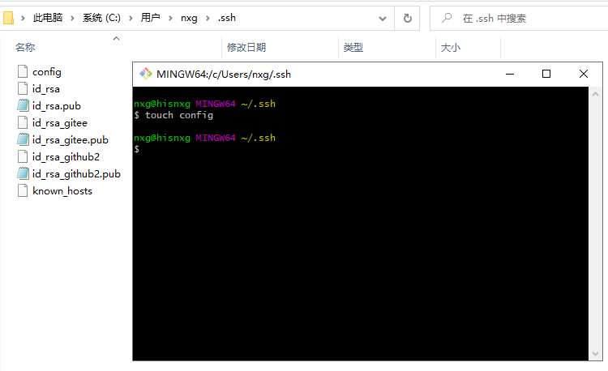

> “#”  表示注释
> Host  后面是名称，可以随便写，相当于起了一个别名
>
> 每一个Host就代表一个仓库，仓库参数另起一行，前有4个空格
> HostName ： 真正连接的服务器地址
>
> ssh的host，SSH地址“git@”后面到冒号前面的内容
>
> `User`：自定义的用户名，一般使用“git”
> `PreferredAuthentications`： 指定优先使用哪种方式验证，支持密码和秘钥验证方式 。使用“publickey”即可，git仓库均为这种形式
>
> 权限认证--可设为publickey,password publickey,keyboard-interactive等
> `IdentityFile`：指定本次连接使用的密钥文件。 该host后台配置的公钥对应的私钥地址的绝对路径
> Port ： SSH默认端口号为22，某些私有部署的git仓库会更换端口号

### 3.2 全局配置

以github为例：

```

# global全局配置,这里使用全局配置
# 设置用户名：
git config --global user.name 'abc'  
# 设置邮箱：
git config --global user.email  "123456@qq.com"

#秘钥添加到本地，即生成密钥
ssh-keygen -t rsa -C "123456@qq.com"

# 同理gitee账号也是这么操作的。
```

注：这里的abc是GitHub**用户名** ，**123456@qq.com**这里是你绑定GitHub上的邮箱

如下图效果：

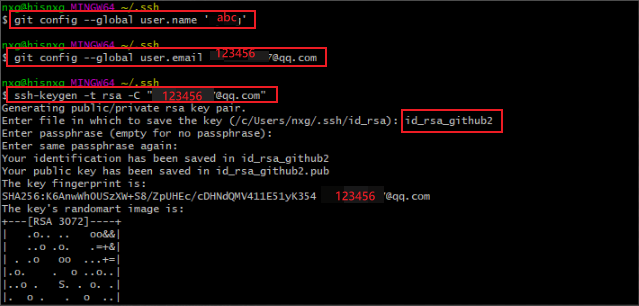

配置gitee效果如下图所示：

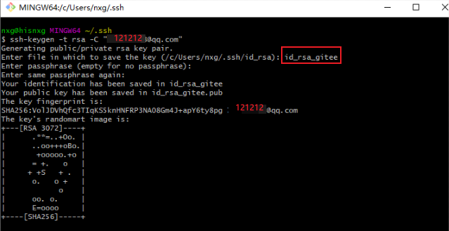

注意：生成密钥文件需要与这里保持一致

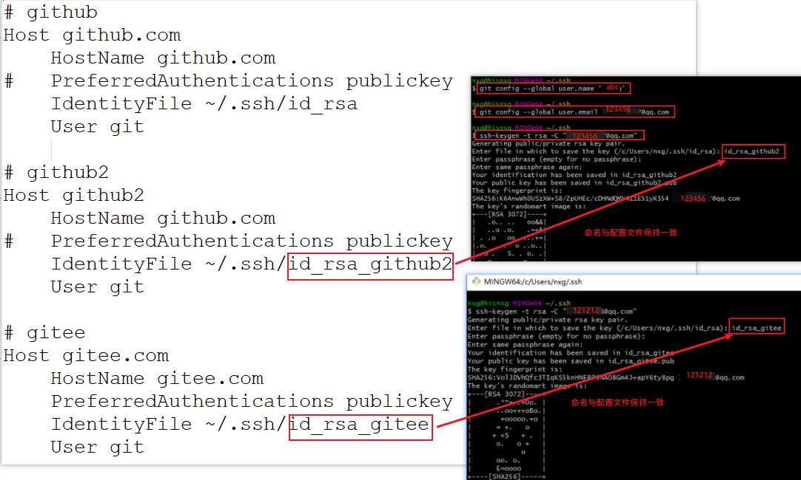

### 测试是否连接成功

测试GitHub是否连接成功：

```
ssh -T git@github2
```

成功效果：

```
Hi abc! You've successfully authenticated, but GitHub does not provide shell access.
```

测试Gitee是否连接成功：

```
$ ssh -T git@gitee.com
```

成功效果：

```
Hi nxg! You've successfully authenticated, but GITEE.COM does not provide shell access.
```


注意事项：

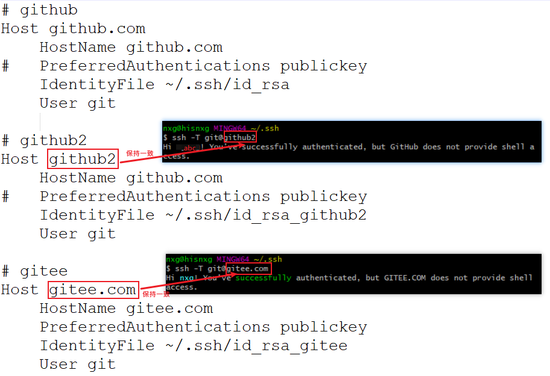

## 四、关联github


将id_rsa_gitee.pub文件中的内容添加到gitee设置中的SSH公钥中。

将id_rsa_github2.pub文件中的内容添加到github的settings的SSH and GPG keys的SSH公钥中。

注：上面的文件都在

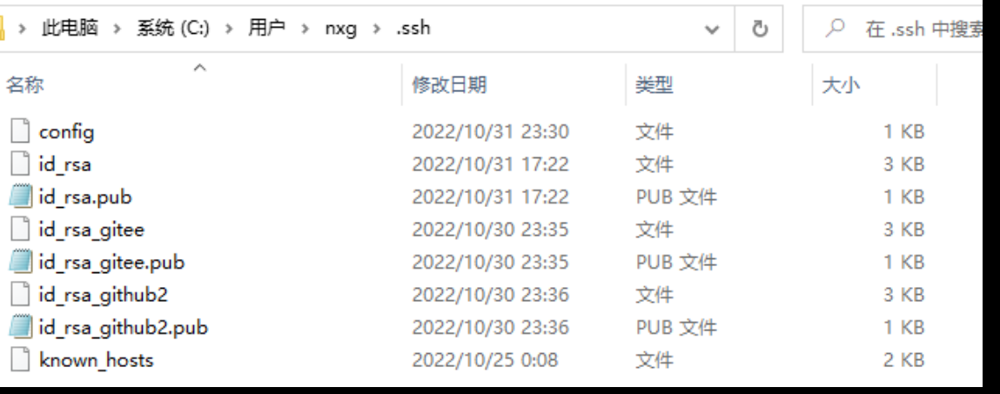

效果如下图所示：

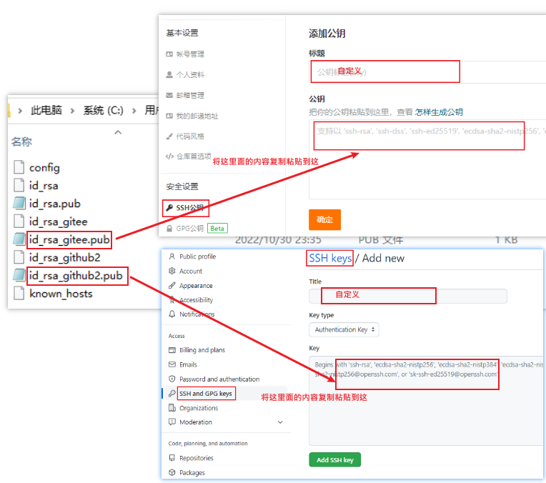

## 注意

在配置多个账号的，方式有多种，可以使用直接修改文件的方式，也可以使用命令的方式

这里使用修改文件的方式


首先需要在这C:\Users\nxg路径下，找到**.gitconfig**文件，并打开此文件

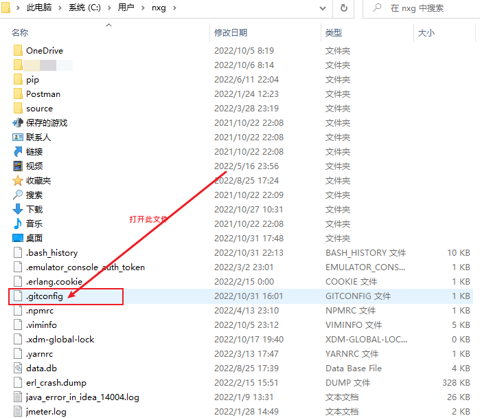

注意：别直接双击打开，需要选择打开方式，选文本打开，或者其他编辑工具打开。

**.gitconfig**文件内容：

```
[user]
	name = xiaoli
	email = 121212@qq.com
[core]
	autocrlf = true
[http]
	sslVerify = false
[user]
	name = abc
	email = 123456@qq.com
[core]
	autocrlf = true
[http]
	sslVerify = false
```

效果如下图所示：

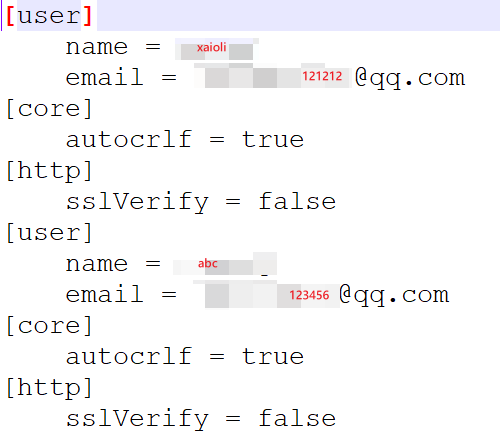

### 查看账号列表：

```
git config --global --list
```

效果如图所示：


### 添加密钥的方式

方式一：

```
ssh-keygen -t rsa -C "123456@qq.com"
```

再执行 **id_rsa**


方式二：

```
ssh-keygen -t rsa -C "2011465907@qq.com" -f ~/.ssh/id_rsa
```

效果如图所示：

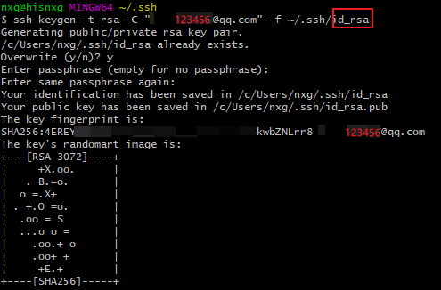

> **ssh-keygen常用参数说明:**
>
> -t: 密钥类型, 可以选择 dsa | ecdsa | ed25519 | rsa;
>
> -f: 密钥目录位置, 默认为当前用户home路径下的.ssh隐藏目录, 也就是~/.ssh/, 同时默认密钥文件名以id_rsa开头. 如果是root用户, 则在/root/.ssh/id_rsa, 若为其他用户, 则在/home/username/.ssh/id_rsa;
>
> -C: 指定此密钥的备注信息, 需要配置多个免密登录时, 建议携带;
>
> -N: 指定此密钥对的密码, 如果指定此参数, 则命令执行过程中就不会出现交互确认密码的信息了.
>
> 举例说明: 同时指定目录位置、密码、注释信息, 就不需要输入回车键即可完成创建:

## 附件

[git单一账号使用教程](https://blog.csdn.net/weixin_45586870/article/details/120446094)

