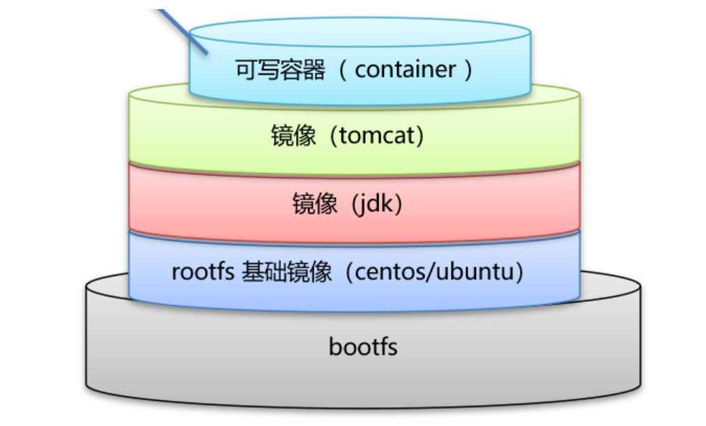
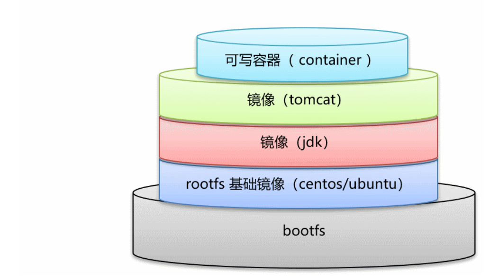
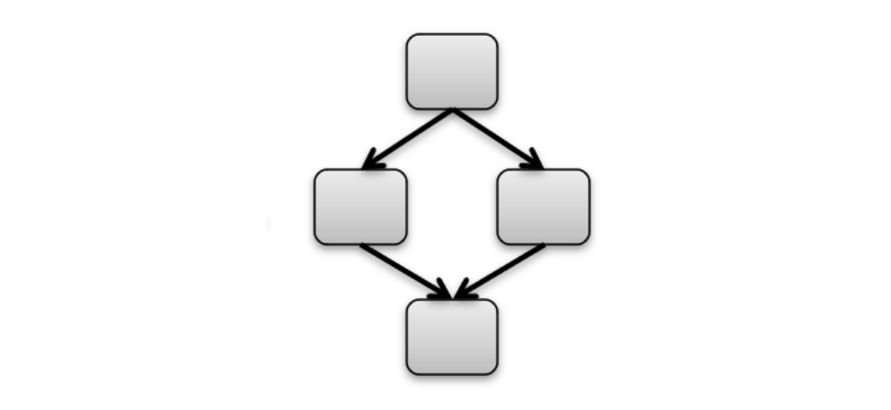

---
# 这是文章的标题
title: centos7.9使用
# 这是页面的图标
icon: page
# 这是侧边栏的顺序
order: 1
# 设置作者
author: nxg
# 设置写作时间
date: 2022-11-16
# 一个页面可以有多个分类
category:
  - linux
# 一个页面可以有多个标签
tag:
  - 后端
  - linux

---

`more` 注释之前的内容被视为文章摘要。

<!-- more -->

## 一、环境安装


### 1.JDK安装

这里安装JDK版本jdk-8u11-linux-x64.tar.gz

注：在登录centos服务器之后切换到根（root）目录下

```
cd /
```

1.在root权限下，在根目录下创建文件夹

```
 mkdir -p /usr/local/java
```

切换到/usr/local/java目录下

```
cd /usr/local/java
```

将该jdk-8u11-linux-x64.tar.gz压缩包上传到当前位置

2.解压jdk-8u11-linux-x64.tar.gz压缩包

```
tar -zxvf ./jdk-8u11-linux-x64.tar.gz -C /usr/local/java/
```

然后切换到根目录下

```
cd /
```

3.编辑Linux系统中环境变量所在文件

```
vi /etc/profile
```

4.在文件最后加入环境变量设置，加入后保存文件

```
export JAVA_HOME=/usr/local/java/jdk1.8.0_11 #这是自己的jdk所在位置
export
CLASSPATH=.:$JAVA_HOME/jre/lib/dt.jar:$JAVA_HOME/jre/lib/rt.jar:$JAVA_HOME/jre/lib/tools.jar
export PATH=$PATH:$JAVA_HOME/bin
```

5.让环境变量生效

```
source /etc/profile
```

6.测试JDK是否已经配置好

```
#执行命令
java -version
#显示如下
java version "1.8.0_11"
Java(TM) SE Runtime Environment (build 1.8.0_11-b12)
Java HotSpot(TM) 64-Bit Server VM (build 25.11-b03, mixed mode)

#执行命令
javac-version
#显示如下
javac 1.8.0_11
```


## 2 .Docker安装

在拉去之前，先配置镜像加速器

阿里云镜像获取地址：https://cr.console.aliyun.com/cn-hangzhou/instances/mirrors，登陆后，左侧菜单选中镜像加速器就可以看到你的专属地址了：


因为工作的需要,需要把docker 启动后的路径改成/data,所以就会用到:*/etc/docker/daemon.json* 是docker 的配置*文件*,默认是没有的,需要我们手动创建,可配置项*如下:*

```
#在根目录下
cd /
#创建docker目录
mkdir -p /etc/docker
# 切换到docker目录下
cd /etc/docker
# 创建daemon.json
touch daemon.json
```

然后打开下面的配置文件：

```
# 在根目录下打开该配置文件
vi /etc/docker/daemon.json
```

在/etc/docker/daemon.json文件末尾增加如下内容：

```
{
  "registry-mirrors": ["https://你的ID.mirror.aliyuncs.com"]
}
```


> 修改完daemon.json文件后，需要让这个文件生效
>
> a.修改完成后reload配置文件
>
> sudo systemctl daemon-reload
>
> b.重启docker服务
>
> sudo systemctl restart docker.service
>
> c.查看状态
>
> sudo systemctl status docker -l
>
> d.查看服务
>
> sudo docker info

***为什么配置这个呢？原因是docker下载镜像速度慢，需要配置国内镜像加速。***

Docker可以运行在MAC、Windows、CentOS、UBUNTU等操作系统上，本课程基于CentOS7安装Docker

官网：https://www.docker.com

```
#1、yum包更新到最新
yum update
#2、安装需要的软件包，yum-util提供yum-config-manager功能，另外两个是devicemapper驱动依赖的
yum install -y yum-utils device-mapper-persistent-data lvm2
#3、设置yum源
yum-config-manager --add-repo https://download.docker.com/linux/centos/docker-ce.repo
#4、安装docker，出现输入的界面都按 y
yum install -y docker-ce
#5、查看docker版本，验证是否验证成功
docker -v
```

#### 2.1docker命令

1.进程相关命令

启动docker服务:

```
systemctl start docker
```

停止docker服务:

```
systemctl stop docker
```

重启docker服务:

```
systemctl restart docker
```

查看docker服务状态:

```
systemctl status docker
```

设置开机启动docker服务:

```
systemctl enable docker
```

2.镜像相关命令

镜像命令包括如下内容：查看镜像、搜索镜像、拉取镜像、删除镜像

查看镜像:查看本地所有的镜像

```
docker images
docker images –q #查看所用镜像的id
```

搜索镜像:从网络中查找需要的镜像

```
docker search 镜像名称
docker search redis #查找redis镜像
```

拉取镜像:从Docker仓库下载镜像到本地，镜像名称格式为名称:版本号，如果版本号不指定则是最新的版本lastest。

如果不知道镜像版本，可以去dockerhub搜索对应镜像查看。

```
docker pull 镜像名称
docker pull redis #下载最新版本redis
docker pull redis:5.0 #下载5.0版本redis
```

删除镜像:删除本地镜像

```
docker rmi 镜像id #删除指定本地镜像
docker images -q #查看所有的镜像列表
dockerrmi `docker images -q` #删除所有本地镜像
```

3.容器相关命令

查看容器、创建容器、进入容器、启动容器、停止容器、删除容器、查看容器信息

查看容器

```
docker ps #查看正在运行的容器
docker ps –a #查看所有容器
```

创建并启动容器

```
docker run 参数
```

参数说明：

-i：保持容器运行。通常与-t同时使用。加入it这两个参数后，容器创建后自动进入容器中，退出容器后，容器自动关闭。

-t：为容器重新分配一个伪输入终端，通常与-i同时使用。

-d：以守护（后台）模式运行容器。创建一个容器在后台运行，需要使用dockerexec进入容器。退出后，容器不会关闭。

-it创建的容器一般称为交互式容器，-id创建的容器一般称为守护式容器

--name：为创建的容器命名。

```
docker run -it --name=c1 centos:7 /bin/bash #创建交互式容器
docker run -id --name=c2 centos:7 #创建守护式容器
```

注意：交互式容器，exit后容器自动关闭，守护式容器会在后台执行

进入容器

```
docker exec -it c2 /bin/bash #进入容器
```

停止容器

```
docker stop 容器名称
```

启动容器

```
dockerstart容器名称
```

删除容器：如果容器是运行状态则删除失败，需要停止容器才能删除

```
docker rm 容器名称
```

查看容器信息

```
docker inspect 容器名称
```

4.Docker容器的数据卷

....

## 3.Docker应用部署

3.1MySQL部署

分析

容器内的网络服务和外部机器不能直接通信

外部机器和宿主机可以直接通信宿主机和容器可以直接通信

当容器中的网络服务需要被外部机器访问时，可以将容器中提供服务的端口映射到宿主机的端口上。外部机器访问宿主机的端口，从而间接访问容器的服务。

这种操作称为：**端口映射**


1.搜索mysql镜像

```
docker search mysql
```

2.拉取mysql镜像

```
docker pull mysql:5.6
```

3.创建容器，设置端口映射、目录映射

```
#在/root目录下创建mysql目录用于存储mysql数据信息
mkdir ~/mysql
cd ~/mysql
```

```
docker run -id \
-p 3307:3306 \
--name=c_mysql \
-v $PWD/conf:/etc/mysql/conf.d \
-v $PWD/logs:/logs \
-v $PWD/data:/var/lib/mysql \
-e MYSQL_ROOT_PASSWORD=123456 \
mysql:5.6
```

参数说明：

-p  3307:3306：将容器的3306端口映射到宿主机的3307端口。

-v  $PWD/conf:/etc/mysql/conf.d：将主机当前目录下的conf/my.cnf挂载到容器的 /etc/mysql/my.cnf 。配置目录

-v  $PWD/logs:/logs：将主机当前目录下的logs目录挂载到容器的/logs。日志目录

-v  $PWD/data:/var/lib/mysql：将主机当前目录下的data目录挂载到容器的/var/lib/mysql。数据目录

-e  MYSQL_ROOT_PASSWORD=123456：初始化root用户的密码。

4.进入容器，操作

```
docker exec -it c_mysql /bin/bash
mysql -u root -p123456
show databases;
create database db1;
```

3.2.Tomcat部署

1.搜索tomcat镜像

```
docker search tomcat
```

2.拉取tomcat镜像

```
docker pull tomcat
```

3.创建容器，设置端口映射、目录映射

```
# 在/root目录下创建tomcat目录用于存储tomcat数据信息
mkdir ~/tomcat
```

执行下面的命令：

```
docker run -id --name=c_tomcat \
-p 8080:8080 \
-v $PWD:/usr/local/tomcat/webapps \
tomcat
```

参数说明：

-p 8080:8080：将容器的8080端口映射到主机的8080端口

-v $PWD:/usr/local/tomcat/webapps：将主机中当前目录挂载到容器的webapps

4.使用外部机器访问tomcat

3.3.Nginx部署

1.搜索nginx镜像

```
docker search nginx
```

2.拉取nginx镜像

```
docker pull nginx
```

3.创建容器，设置端口映射、目录映射

```
# 在root目录下创建nginx目录用于存储nginx数据信息
mkdir ~/nginx
cd ~/nginx
mkdir conf
cd conf
#在~/nginx/conf/下创建nginx.conf文件,粘贴下面内容
vim nginx.conf
```

执行下面的命令：

```
user nginx;
worker_processes 1;

error_log 	/var/log/nginx/error.log warn;
pid 		/var/run/nginx.pid;

events{
	worker_connections 1024;
}

http{
    include 	/etc/nginx/mime.types;
    default_type application/octet-stream;
    log_format	main '$remote_addr-$remote_user[$time_local]"$request"'
                    '$status$body_bytes_sent"$http_referer"'
                    '"$http_user_agent""$http_x_forwarded_for"';
    access_log	/var/log/nginx/access.log main;

    sendfile	on;
    #tcp_nopush	on;

    keepalive_timeout 65;

    #gzip on;
    include /etc/nginx/conf.d/*.conf;
}
```

执行下面的命令启动nginx容器：

```
docker run -id --name=c_nginx \
-p 80:80 \
-v $PWD/conf/nginx.conf:/etc/nginx/nginx.conf \
-v $PWD/logs:/var/log/nginx \
-v $PWD/html:/usr/share/nginx/html \
nginx
```

3.4.Redis部署

1.搜索redis镜像

```
docker search redis
```

2.拉取redis镜像

```
docker pull redis:5.0
```

3.创建容器，设置端口映射

```
docker run -id --name=c_redis -p 6379:6379 redis:5.0
```

4.使用外部机器连接redis

```
./redis-cli.exe -h 192.168.220.12 -p 6379
keys *
set name keney
get name
```


## 4.Dockerfile

4.1docker镜像原理：

思考： 

Docker 镜像本质是什么？ 

Docker 中一个centos镜像为什么只有200MB，而一个centos操作系统的iso文件要几个个G？ 

Docker 中一个tomcat镜像为什么有600MB，而一个tomcat安装包只有70多MB？ 

操作系统组成部分： 

进程调度子系统 

进程通信子系统 

内存管理子系统 

设备管理子系统 

文件管理子系统 

网络通信子系统 

作业控制子系统 

Linux文件系统由bootfs和rootfs两部分组成 

bootfs：包含bootloader（引导加载程序）和 kernel（内核） rootfs： root文件系统，包含的就是典型 Linux 系统中的/dev，/proc，/bin，/etc等标准目录和文件 

不同的linux发行版，bootfs基本一样，而rootfs不同，如ubuntu，centos等


docker镜像原理 

Docker镜像是由特殊的文件系统叠加而成 

最底端是 bootfs，并使用宿主机的bootfs 

第二层是 root文件系统rootfs,称为base image 然后再往上可以叠加其他的镜像文件 

统一文件系统（Union File System）技术能够将不同的层整合成一个文件系统，为这些层提供了一个统一的 视角，这样就隐藏了多层的存在，在用户的角度看来，只存在一个文件系统。 

一个镜像可以放在另一个镜像的上面。位于下面的镜像称为父镜像，最底部的镜像成为基础镜像。 

当从一个镜像启动容器时，Docker会在最顶层加载一个读写文件系统作为容器



回答问题 

1.Docker 镜像本质是什么？ 是一个分层文件系统 

2.Docker 中一个centos镜像为什么只有200MB，而一个centos操作系统的iso文件要几个个G？ 

Centos的iso镜像文件包含bootfs和rootfs，而docker的centos镜像复用操作系统的bootfs，只有rootfs和其 他镜像层

3.Docker 中一个tomcat镜像为什么有600MB，而一个tomcat安装包只有70多MB？ 由于docker中镜像是分层的，tomcat虽然只有70多MB，但他需要依赖于父镜像和基础镜像，所有整个对外 暴露的tomcat镜像大小600多MB

4.2镜像制作

容器转换镜像

```
docker commit 容器id 镜像名称:版本号
docker save -o 压缩文件名称 镜像名称:版本号
docker load –i 压缩文件名称
```



```
# 创建tomcat镜像
docker run -id --name=c_tomcat \
-p 8080:8080 \
-v $PWD:/usr/local/tomcat/webapps \
tomcat
# 进入tomcat镜像
docker exec -it c_tomcat /bin/bash
#创建a.txt b.txt
cd ~
touch a.txt b.txt
```

执行操作：

```
#容器转镜像
docker commit 28b8d4dc9744 lxs_tomcat:1.0
#压缩镜像
docker save -o lxs_tomcat.tar lxs_tomcat:1.0
#删除原来镜像
docker rmi lxs_tomcat:1.0
#从压缩文件加载镜像
docker load -i lxs_tomcat.tar
#产生镜像
docker run -it --name=new_tomcat lxs_tomcat:1.0 /bin/bash
#进入查看内容
docker exec -it c_tomcat /bin/bash
#可以看到a.txt b.txt存在，而webapps/test不存在
```

dockerfile

概念 

Dockerfile 是一个文本文件 

包含了一条条的指令 

每一条指令构建一层，基于基础镜像，最终构建出一个新的镜像 

对于开发人员：可以为开发团队提供一个完全一致的开发环境 

对于测试人员：可以直接拿开发时所构建的镜像或者通过Dockerfile文件构建一个新的镜像开始工作了 

对于运维人员：在部署时，可以实现应用的无缝移植 

参考Dochub网址：https://hub.docker.com ，比如centos和nginx镜像

| 关键字      | 作用                       | 备注                                                         |
| ----------- | -------------------------- | ------------------------------------------------------------ |
| FROM        | 指定父镜像                 | 指定dockerfile基于那个image构建                              |
| MAINTAINER  | 作者信息 用                | 用来标明这个dockerfile谁写的                                 |
| LABEL       | 标签                       | 用来标明dockerfile的标签 可以使用Label代替Maintainer 最终都是在 docker image基本信息中可以查看 |
| RUN         | 容器启动命 令              | 执行一段命令 默认是/bin/sh 格式: RUN command 或者 RUN ["command" , "param1","param2"] |
| CMD         | 容器启动命 令              | 提供启动容器时候的默认命令 和ENTRYPOINT配合使用.格式 CMD command param1 param2 或者 CMD ["command" , "param1","param2"] |
| ENTRYPOINT  | 入口                       | 一般在制作一些执行就关闭的容器中会使用                       |
| COPY        | 复制文件                   | build的时候复制文件到image中                                 |
| ADD         | 添加文件                   | build的时候添加文件到image中 不仅仅局限于当前build上下文 可以来 源于远程服务 |
| ENV         | 环境变量                   | 指定build时候的环境变量 可以在启动的容器的时候 通过-e覆盖 格式 ENV name=value |
| ARG         | 构建参数                   | 构建参数 只在构建的时候使用的参数 如果有ENV 那么ENV的相同名字 的值始终覆盖arg的参数 |
| VOLUME      | 定义外部可 以挂载的数 据卷 | 指定build的image那些目录可以启动的时候挂载到文件系统中 启动容 器的时候使用 -v 绑定 格式 VOLUME ["目录"] |
| EXPOSE      | 暴露端口                   | 定义容器运行的时候监听的端口 启动容器的使用-p来绑定暴露端口 格 式: EXPOSE 8080 或者 EXPOSE 8080/udp |
| WORKDIR     | 工作目录                   | 指定容器内部的工作目录 如果没有创建则自动创建 如果指定/ 使用的是 绝对地址 如果不是/开头那么是在上一条workdir的路径的相对路径 |
| USER        | 指定执行用 户              | 指定build或者启动的时候 用户 在RUN CMD ENTRYPONT执行的时候 的用户 |
| HEALTHCHECK | 健康检查                   | 指定监测当前容器的健康监测的命令 基本上没用 因为很多时候 应用本 身有健康监测机制 |
| ONBUILD     | 触发器                     | 当存在ONBUILD关键字的镜像作为基础镜像的时候 当执行FROM完成 之后 会执行 ONBUILD的命令 但是不影响当前镜像 用处也不怎么大 |
| STOPSIGNAL  | 发送信号量 到宿主机        | 该STOPSIGNAL指令设置将发送到容器的系统调用信号以退出。       |
| SHELL       | 指定执行脚 本的shell       | 指定RUN CMD ENTRYPOINT 执行命令的时候 使用的shell            |
|             |                            |                                                              |

---

案例一：

自定义centos7镜像。 

要求： 

1. 默认登录路径为 /usr
2. 可以使用vim 

实现步骤 

定义父镜像：FROM centos:7 

定义作者信息：MAINTAINER lxs lxs@lxs.cn 

执行安装vim命令： RUN yum install -y vim 

定义默认的工作目录：WORKDIR /usr 

定义容器启动执行的命令：CMD /bin/bash 

通过dockerfile构建镜像：docker bulid –f dockerfile文件路径 –t 镜像名称:版本 .

```
#具体代码
mkdir ~/docker-files
cd ~/docker-files
vim centos_dockerfile
```

dockerfile具体内容

```
FROM centos:7
MAINTAINER lxs <lxs@lxs.cn>
RUN yum install -y vim
WORKDIR /usr
CMD /bin/bash
```

build

```
docker build -f ./centos_dockerfile -t lxs_centos:1 .
```

-f：镜像文件 

-t：新镜像名 

. 寻址路径

```
#进入看效果
docker run -it --name=c2 lxs_centos:1
```

案例二：发布springboot项目 

定义父镜像：FROM java:8

定义作者信息：MAINTAINER lxs lxs@163.com 

将jar包添加到容器： ADD springboot.jar app.jar 

定义容器启动执行的命令：CMD ["java","-jar","app.jar"] 

通过dockerfile构建镜像：docker bulid –f dockerfile文件路径 –t 镜像名称:版本 .

```
FROM java:8
MAINTAINER lxs <lxs@163.com>
ADD springboot.jar app.jar
CMD ["java","-jar","app.jar"]
```

build

```
docker bulid –f ./springboot_dockerfile –t app .
```

启动容器

```
docker run -id -p 9000:8080 app
```

## 5.服务编排

5.1. 概念

微服务架构的应用系统中一般包含若干个微服务，每个微服务一般都会部署多个实例，如果每个微服务都要手动启 动停止，维护的工作量会很大。来看下我们日常工作： 

要从Dockerfile build image 或者去dockerhub拉取image 

要创建多个container 

要管理这些container（启动停止删除） 

通过服务编排可以大量简化上面的工作服务编排：按照一定的业务规则批量管理容器

5.2 Docker Compose

Docker Compose是一个编排多容器分布式部署的工具，提供命令集中管理容器化应用的完整开发周期，包括服务 构建，启动和停止。使用步骤：

1. 利用 Dockerfile 定义运行环境镜像
2.  使用 docker-compose.yml 定义组成应用的各服务 
3. 运行 docker-compose up 启动应用



安装Docker Compose

```
# Compose目前已经完全支持Linux、Mac OS和Windows，在我们安装Compose之前，需要先安装Docker。下面我 们以
编译好的二进制包方式安装在Linux系统中。
curl -L https://github.com/docker/compose/releases/download/1.22.0/docker-compose-`uname -s`-
`uname -m` -o /usr/local/bin/docker-compose
# 设置文件可执行权限
chmod +x /usr/local/bin/docker-compose
# 查看版本信息
docker-compose -version
```

卸载Docker Compose

```
# 二进制包方式安装的，删除二进制文件即可
rm /usr/local/bin/docker-compose
```

编排nginx+springboot

需求：使用nginx反向代理到springboo应用

 1. 创建docker-compose目录

```
mkdir ~/docker-compose
cd ~/docker-compose
```

2.编写 docker-compose.yml 文件

```
version: '3'
services:
nginx:
image: nginx
ports:
- 80:80
links:
- app
volumes:
- ./nginx/conf.d:/etc/nginx/conf.d
app:
image: app
expose:
- "8080"
```

3.创建./nginx/conf.d目录

```
mkdir -p ./nginx/conf.d
```

4.在./nginx/conf.d目录下 编写app.conf文件

```
server {
    listen 80;
    access_log off;
    
    location / {
  	  proxy_pass http://app:8080/hello;
    }
}

```

5.在~/docker-compose 目录下 使用docker-compose 启动容器

```
docker-compose up -d # -d表示已守护模式启动
```

6. 测试访问

```
http://192.168.220.12/hello
```


## 6.Docker私有仓库

> Docker官方的Docker hub（https://hub.docker.com）是一个用于管理公共镜像的仓库，我们可以从上面拉 取镜像 到本地，也可以把我们自己的镜像推送上去。但是，有时候我们不希望将自己的镜 像放到公网当中， 那么这时我们就需要搭建自己的私有仓库来存储和管理自己的镜像

6.1. 私有仓库搭建

```
# 1、拉取私有仓库镜像
docker pull registry
# 2、启动私有仓库容器
docker run -id --name=registry -p 5000:5000 registry
# 3、打开浏览器 输入地址http://私有仓库服务器ip:5000/v2/_catalog，看到{"repositories":[]} 表示私有仓
库 搭建成功
# 4、修改daemon.json
vim /etc/docker/daemon.json
# 在上述文件中添加一个key，保存退出。此步用于让 docker 信任私有仓库地址；注意将私有仓库服务器ip修改为自
己私有仓库服务器真实ip
{"insecure-registries":["私有仓库服务器ip:5000"]}
{"insecure-registries":["192.168.220.12:5000"]}
# 5、重启docker 服务
systemctl restart docker
docker start registry

```

6.2将镜像上传至私有仓库

```
# 1、标记镜像为私有仓库的镜像
docker tag centos:7 192.168.220.12:5000/centos:7
# 2、上传标记的镜像
docker push 192.168.220.12:5000/centos:7
```

从私有仓库拉取镜像

```
#拉取镜像
docker pull 192.168.220.12:5000/centos:7
```


## 附件

参考：https://www.cnblogs.com/yakniu/p/16329611.html

参考：服务端口占用情况：https://www.leixue.com/qa/how-does-centos-check-port-occupancy

参考mysql数据库问题：

【MySql】Navicat 连接数据库出现1251 - Client does not support authentication protocol ...... 问题的解决方法：

https://blog.csdn.net/pengfeng111833/article/details/124399404

https://blog.csdn.net/piupiu78/article/details/122468163
