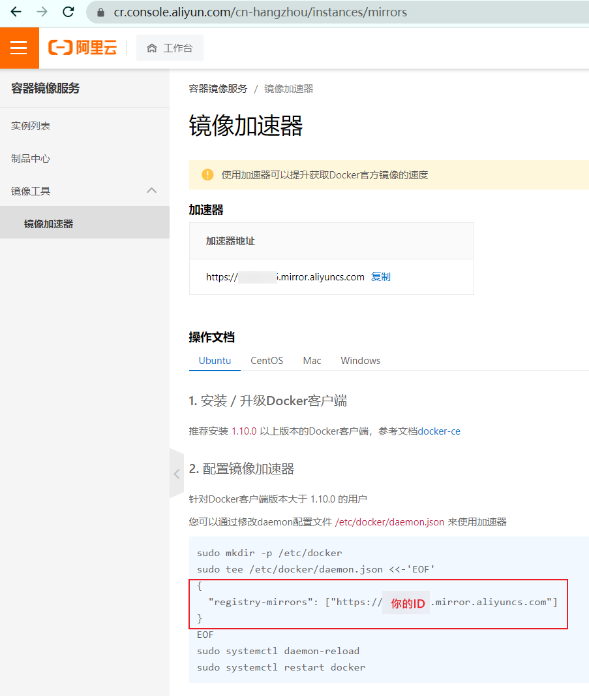
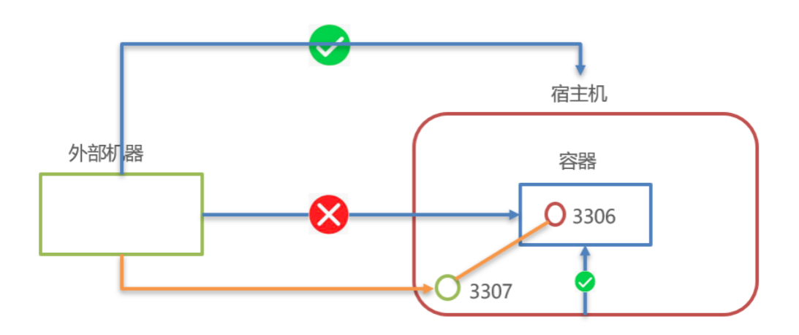

---
# 这是文章的标题
title: centos7.9使用
# 这是页面的图标
icon: page
# 这是侧边栏的顺序
order: 1
# 设置作者
author: nxg
# 设置写作时间
date: 2022-11-16
# 一个页面可以有多个分类
category:
  - linux
# 一个页面可以有多个标签
tag:
  - 后端
  - linux

---

`more` 注释之前的内容被视为文章摘要。

<!-- more -->

## 一、环境安装


### 1.JDK安装

这里安装JDK版本jdk-8u11-linux-x64.tar.gz

注：在登录centos服务器之后切换到根（root）目录下

```
cd /
```

1.在root权限下，在根目录下创建文件夹

```
 mkdir -p /usr/local/java
```

切换到/usr/local/java目录下

```
cd /usr/local/java
```

将该jdk-8u11-linux-x64.tar.gz压缩包上传到当前位置

2.解压jdk-8u11-linux-x64.tar.gz压缩包

```
tar -zxvf ./jdk-8u11-linux-x64.tar.gz -C /usr/local/java/
```

然后切换到根目录下

```
cd /
```

3.编辑Linux系统中环境变量所在文件

```
vi /etc/profile
```

4.在文件最后加入环境变量设置，加入后保存文件

```
export JAVA_HOME=/usr/local/java/jdk1.8.0_11 #这是自己的jdk所在位置
export
CLASSPATH=.:$JAVA_HOME/jre/lib/dt.jar:$JAVA_HOME/jre/lib/rt.jar:$JAVA_HOME/jre/lib/tools.jar
export PATH=$PATH:$JAVA_HOME/bin
```

5.让环境变量生效

```
source /etc/profile
```

6.测试JDK是否已经配置好

```
#执行命令
java -version
#显示如下
java version "1.8.0_11"
Java(TM) SE Runtime Environment (build 1.8.0_11-b12)
Java HotSpot(TM) 64-Bit Server VM (build 25.11-b03, mixed mode)

#执行命令
javac-version
#显示如下
javac 1.8.0_11
```


## 2 .Docker安装

在拉去之前，先配置镜像加速器

阿里云镜像获取地址：https://cr.console.aliyun.com/cn-hangzhou/instances/mirrors，登陆后，左侧菜单选中镜像加速器就可以看到你的专属地址了：



因为工作的需要,需要把docker 启动后的路径改成/data,所以就会用到:*/etc/docker/daemon.json* 是docker 的配置*文件*,默认是没有的,需要我们手动创建,可配置项*如下:*

```
#在根目录下
cd /
#创建docker目录
mkdir -p /etc/docker
# 切换到docker目录下
cd /etc/docker
# 创建daemon.json
touch daemon.json
```

然后打开下面的配置文件：

```
# 在根目录下打开该配置文件
vi /etc/docker/daemon.json
```

在/etc/docker/daemon.json文件末尾增加如下内容：

```
{
  "registry-mirrors": ["https://你的ID.mirror.aliyuncs.com"]
}
```


> 修改完daemon.json文件后，需要让这个文件生效
>
> a.修改完成后reload配置文件
>
> sudo systemctl daemon-reload
>
> b.重启docker服务
>
> sudo systemctl restart docker.service
>
> c.查看状态
>
> sudo systemctl status docker -l
>
> d.查看服务
>
> sudo docker info

***为什么配置这个呢？原因是docker下载镜像速度慢，需要配置国内镜像加速。***

Docker可以运行在MAC、Windows、CentOS、UBUNTU等操作系统上，本课程基于CentOS7安装Docker

官网：https://www.docker.com

```
#1、yum包更新到最新
yum update
#2、安装需要的软件包，yum-util提供yum-config-manager功能，另外两个是devicemapper驱动依赖的
yum install -y yum-utils device-mapper-persistent-data lvm2
#3、设置yum源
yum-config-manager --add-repo https://download.docker.com/linux/centos/docker-ce.repo
#4、安装docker，出现输入的界面都按 y
yum install -y docker-ce
#5、查看docker版本，验证是否验证成功
docker -v
```

#### 2.1docker命令

1.进程相关命令

启动docker服务:

```
systemctl start docker
```

停止docker服务:

```
systemctl stop docker
```

重启docker服务:

```
systemctl restart docker
```

查看docker服务状态:

```
systemctl status docker
```

设置开机启动docker服务:

```
systemctl enable docker
```

2.镜像相关命令

镜像命令包括如下内容：查看镜像、搜索镜像、拉取镜像、删除镜像

查看镜像:查看本地所有的镜像

```
docker images
docker images –q #查看所用镜像的id
```

搜索镜像:从网络中查找需要的镜像

```
docker search 镜像名称
docker search redis #查找redis镜像
```

拉取镜像:从Docker仓库下载镜像到本地，镜像名称格式为名称:版本号，如果版本号不指定则是最新的版本lastest。

如果不知道镜像版本，可以去dockerhub搜索对应镜像查看。

```
docker pull 镜像名称
docker pull redis #下载最新版本redis
docker pull redis:5.0 #下载5.0版本redis
```

删除镜像:删除本地镜像

```
docker rmi 镜像id #删除指定本地镜像
docker images -q #查看所有的镜像列表
dockerrmi `docker images -q` #删除所有本地镜像
```

3.容器相关命令

查看容器、创建容器、进入容器、启动容器、停止容器、删除容器、查看容器信息

查看容器

```
docker ps #查看正在运行的容器
docker ps –a #查看所有容器
```

创建并启动容器

```
docker run 参数
```

参数说明：

-i：保持容器运行。通常与-t同时使用。加入it这两个参数后，容器创建后自动进入容器中，退出容器后，容器自动关闭。

-t：为容器重新分配一个伪输入终端，通常与-i同时使用。

-d：以守护（后台）模式运行容器。创建一个容器在后台运行，需要使用dockerexec进入容器。退出后，容器不会关闭。

-it创建的容器一般称为交互式容器，-id创建的容器一般称为守护式容器

--name：为创建的容器命名。

```
docker run -it --name=c1 centos:7 /bin/bash #创建交互式容器
docker run -id --name=c2 centos:7 #创建守护式容器
```

注意：交互式容器，exit后容器自动关闭，守护式容器会在后台执行

进入容器

```
docker exec -it c2 /bin/bash #进入容器
```

停止容器

```
docker stop 容器名称
```

启动容器

```
dockerstart容器名称
```

删除容器：如果容器是运行状态则删除失败，需要停止容器才能删除

```
docker rm 容器名称
```

查看容器信息

```
docker inspect 容器名称
```

4.Docker容器的数据卷

....

## 3.Docker应用部署

3.1MySQL部署

分析

容器内的网络服务和外部机器不能直接通信

外部机器和宿主机可以直接通信宿主机和容器可以直接通信

当容器中的网络服务需要被外部机器访问时，可以将容器中提供服务的端口映射到宿主机的端口上。外部机器访问宿主机的端口，从而间接访问容器的服务。

这种操作称为：**端口映射**



1.搜索mysql镜像

```
docker search mysql
```

2.拉取mysql镜像

```
docker pull mysql:5.6
```

3.创建容器，设置端口映射、目录映射

```
#在/root目录下创建mysql目录用于存储mysql数据信息
mkdir ~/mysql
cd ~/mysql
```

```
docker run -id \
-p 3307:3306 \
--name=c_mysql \
-v$PWD/conf:/etc/mysql/conf.d \
-v$PWD/logs:/logs \
-v$PWD/data:/var/lib/mysql \
-eMYSQL_ROOT_PASSWORD=123456 \
mysql:5.6
```

参数说明：

-p  3307:3306：将容器的3306端口映射到宿主机的3307端口。

-v $PWD/conf:/etc/mysql/conf.d：将主机当前目录下的conf/my.cnf挂载到容器的 /etc/mysql/my.cnf 。配置目录

-v $PWD/logs:/logs：将主机当前目录下的logs目录挂载到容器的/logs。日志目录

-v $PWD/data:/var/lib/mysql：将主机当前目录下的data目录挂载到容器的/var/lib/mysql。数据目录

-e MYSQL_ROOT_PASSWORD=123456：初始化root用户的密码。

4.进入容器，操作mysqldockersearchmysqldockerpullmysql:5.6

```
docker exec -it c_mysql /bin/bash
mysql -uroot -p123456
show databases;
create database db1;
```

3.22.Tomcat部署


---


## 附件

参考：https://www.cnblogs.com/yakniu/p/16329611.html

